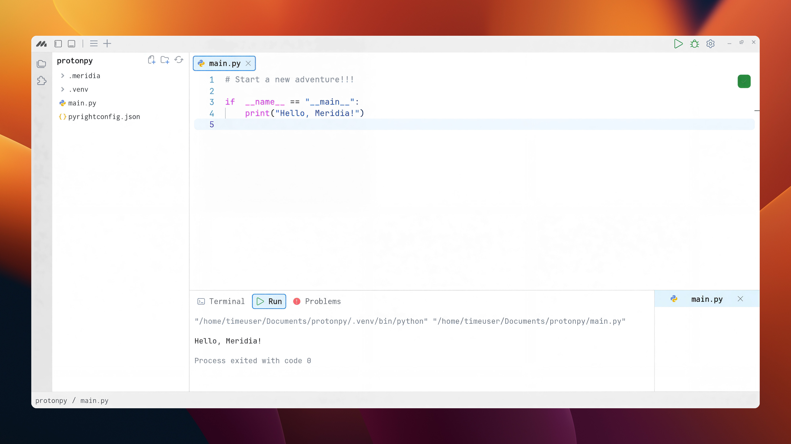

# Meridia



Meridia is a modern IDE designed for developers. While its core focus is Python, it now **supports multiple programming languages** including JavaScript, TypeScript, Rust, Bash, Java, C, C++, Lua, Swift, SQL, and more. This means you can **write, run, and manage projects in different languages without leaving the IDE**.

It combines a clean, minimal design with powerful tools for coding, data workflows, and visualization—all in one place.

## Getting Started

Clone and start the project locally:

```bash
git clone https://github.com/MeridiaByMNovus/Meridia.git
```

```bash
npm install
```

```bash
npm run dev
```

## Environment Variables

Create a `.env` file in the root directory and add:

```bash
NODE_ENV=development
```

## Features

- **Intelligent Code Editor** — Autocompletion, inline documentation, linting, and real-time code suggestions.
- **AI Assistance** — Context-aware code suggestions and inline completions powered by AI.
- **Mira, the Voice Assistant** — Perform file actions, describe code, write snippets, run commands, and control the IDE hands-free.
- **Integrated Terminal** — Run commands and manage your environment without leaving the IDE.
- **Multi-Language Support** — Write and manage projects in Python, JavaScript, TypeScript, Rust, Bash, Java, C, C++, Lua, Swift, SQL, and more—all within the same IDE.
- **File Explorer** — Browse, create, rename, and organize files with a clean interface.
- **Tabs and Window Management** — Manage multiple files with a modern tab system and resizable panels.
- **Data-Centric Tools** — Import, clean, and preview datasets directly inside the IDE.
- **Built-in Visualization** — Generate charts and quick data insights without leaving your workflow.
- **Customizable Layout** — Tailor panels, themes, and settings to your workflow.
- **Theme System** — Switch between predefined themes or create your own with full customization.
- **Plugin Architecture (Planned)** — Extend Meridia with plugins for additional tools, panels, and integrations.
- **Cross-Platform** — Available for Windows and Linux.
