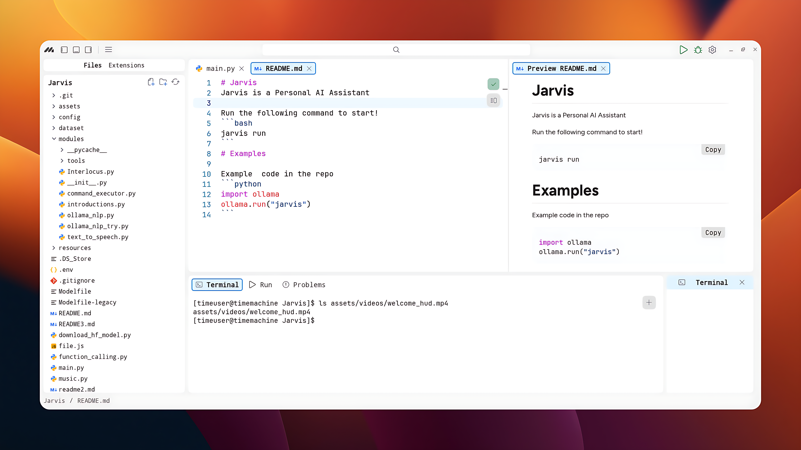

# Meridia

### Still under development

Meridia is a next-gen code editor that blends coding, debugging, and customizable.



Visit [meridia.dev](https://meridia.dev) for more info.

# Documentation

If you want to read about using Meridia or developing extensions in Meridia, the [Documentation](https://meridia.dev/documentation) is available.

# Installing

## Prerequisites

- [Git](https://git-scm.com/)

### Windows

Download the latest [Meridia installer](https://meridia.dev/download/windows)

Meridia will automatically update when a new release is available.

### Linux

#### For arch

```bash
yay -S meridia
```

### For ubuntu

```bash
sudo apt install meridia
```

### For others

1. Download meridia.tar.gz from the Meridia releases page.
2. Run tar xf meridia.tar.gz in the directory where you want to extract the Meridia folder.
3. Launch Meridia using the installed Meridia command from the newly extracted directory.

# License

[Mit](https://github.com/ridit-jangra/Meridia/blob/main/LICENSE)
