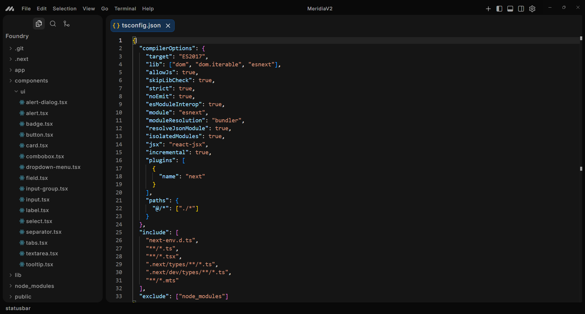

⚠️ The v2 branch contains the complete core rewrite.
Main branch holds the stable v1 release.

# Meridia V2 (Alpha)

Meridia is a next-gen code editor that blends coding, debugging, and customizable.

Visit [meridia.dev](https://meridia.dev) for more info.

# Documentation

If you want to read about using Meridia or developing extensions in Meridia, the [Documentation](https://meridia.dev/docs) is available.

# Installing

## Prerequisites

- [Git](https://git-scm.com/)

### Windows

Download the latest [Meridia installer](https://meridia.dev/download)

Meridia will automatically update when a new release is available.

### Linux

Download the latest [Meridia App Image](https://meridia.dev/download)

Meridia will automatically update when a new release is available.

# License

[Mit](https://github.com/ridit-jangra/Meridia/blob/main/LICENSE)
