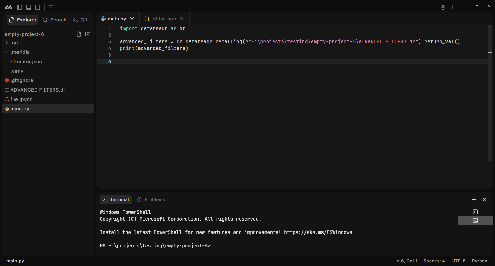

# Meridia V2 (Alpha)



Meridia is a modern code editor where you code, and AI collaborates — never takes control.

Visit [meridia.dev](https://meridia.dev) for more info.

# Documentation

If you want to read about using Meridia or developing extensions in Meridia, the [Documentation](https://meridia.dev/docs) is available.

# Installation

## Prerequisites

- [Git](https://git-scm.com/)

### Windows

Download the latest [Meridia installer](https://meridia.dev/download)

Meridia will automatically update when a new release is available.

### Linux

Download the latest [Meridia App Image](https://meridia.dev/download)

Meridia will automatically update when a new release is available.

# Installing Locally

## Prerequisites

- [Git](https://git-scm.com/)
- [Node 20.x.x](https://nodejs.org/)
- [Python 13+](https://python.org/)
- [NPM or Yarn](https://npmjs.com/)
- [Ollama](https://ollama.com/download) (optional, for AI features)

### Clone the repository

```bash
git clone https://github.com/ridit-jangra/Meridia
cd Meridia
```

### Install Dependencies

Using npm

```bash
npm install
```

Using yarn

```bash
yarn install
```

### Rebuild Native Modules

Using npm

```
npm rebuild
```

Using yarn

```bash
yarn run rebuild
```

### Run Development Mode

Using npm

```
npm run dev
```

Using yarn

```
yarn dev
```

### Build package

Using npm

```
npm run build
```

Using yarn

```
yarn build
```

# Contributing

Contributions are welcome.

Please read `CONTRIBUTING.md` before submitting a PR.

# License

[Mit](https://github.com/ridit-jangra/Meridia/blob/main/LICENSE)
